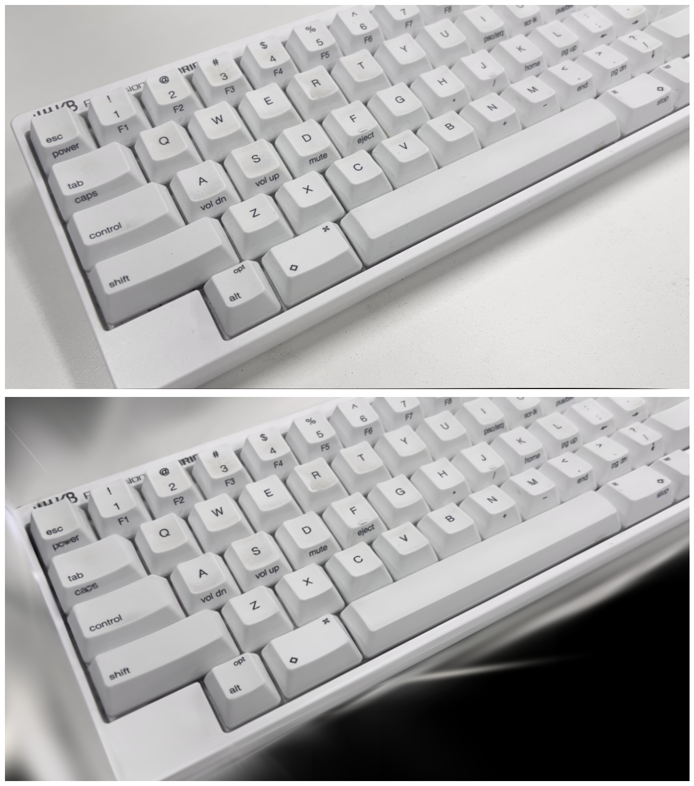
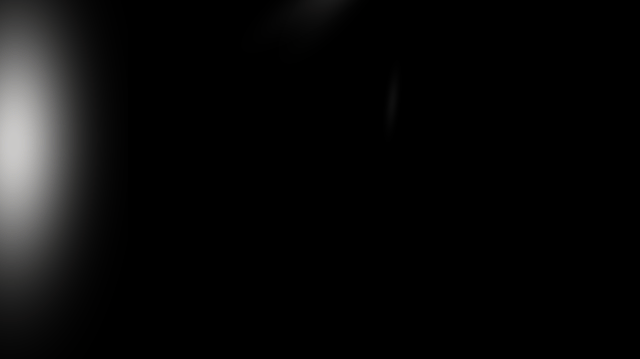
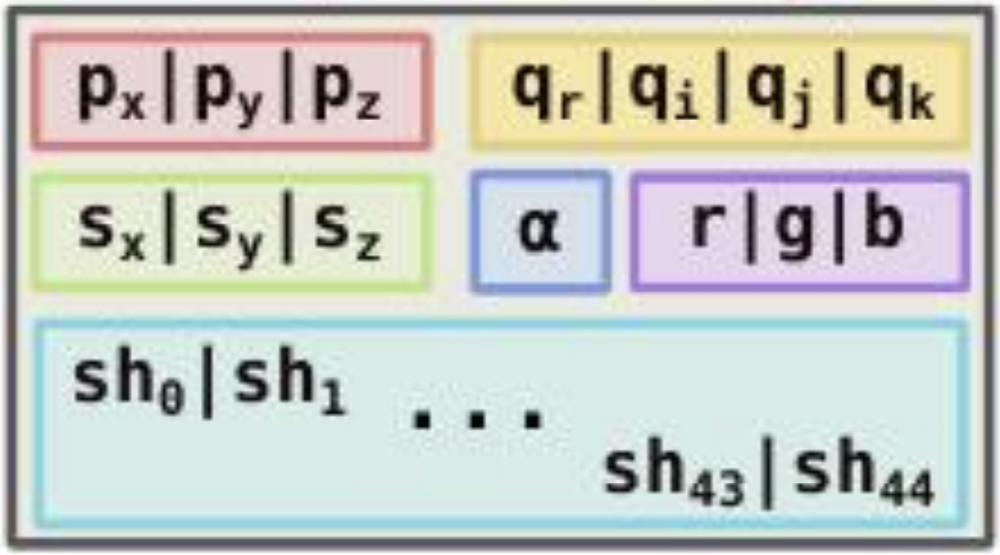

# Learning Gaussian Splatting

> I want to fully grasp [3D Gaussian Splatting](https://repo-sam.inria.fr/fungraph/3d-gaussian-splatting/). The original code was a bit tough to follow without computer graphics or CUDA background, especially tile-based rendering. So I'm trying my best to implement it from scratch with NumPy and PyTorch, starting with rendering. Simplicity is prioritized over performance. 


## Core Code Statistics

```bash

# tokei camera.py gaussian.py render.py utils.py
├── 📄 camera.py   # Camera model and view transformation utilities
├── 📄 gaussian.py # 3D Gaussian representation and operations
├── 📄 render.py   # Rendering pipeline and projection functions
└── 📄 utils.py    # Helper functions and common utilities

===============================================================================
 Language            Files        Lines         Code     Comments       Blanks
===============================================================================
 Python                  4          662          529           44           89
===============================================================================
```

## Getting Started

### Installation

1. Clone the repository:

```bash
git clone https://github.com/suous/learn-gaussian-splatting.git
cd learn-gaussian-splatting
```

2. Install the required dependencies.

```bash
uv sync
```

3. Activate the environemtn.

```bash
source .venv/bin/activate
```

### Data Download

Download the COLMAP and PLY data from [Release v1.0](https://github.com/suous/learn-gaussian-splatting/releases/tag/v1.0):
```bash
wget -qO-  https://github.com/suous/learn-gaussian-splatting/releases/download/v1.0/data.tgz  | tar xz -C .
```

This will create a data directory with the following structure:

```bash
data
├── colmap
│   ├── images
│   │   ├── 000000.png
│   │   ├── ..........
│   │   └── 000024.png
│   └── sparse
│       └── 0
│           ├── cameras.bin
│           ├── images.bin
│           ├── points3D.bin
│           └── points3D.ply
└── point_cloud.ply
```

```bash
# python gaussian.py
==================================================
          Gaussian Splatting Statistics
==================================================

    🎯 Positions  : (37942, 3)
    🔄 Rotations  : (37942, 4)
    📏 Scalings   : (37942, 3)
    💫 Opacities  : (37942, 1)
    🎨 Features   : (37942, 3, 16)
    📊 Covariances: (37942, 3, 3)
    
--------------------------------------------------
Total Gaussians: 37,942
SH Degree      : 3
==================================================
```

### Usage

1. Render an Image

```bash
python main.py --image_number 0
```

This will display the original image and the rendered image using matplotlib.

2. Generate animation

```bash
python main.py --generate_animation
```

```bash
ffmpeg -framerate 8 -pattern_type glob -i "*.png" -vf "fps=10,scale=640:-1,split[s0][s1];[s0]palettegen[p];[s1][p]paletteuse" -loop 0 animation.gif
```

### Results





## Basic Idea of 3D Gaussian Splatting

3D Gaussian Splatting (3DGS) is a novel method for representing and rendering 3D scenes, introduced in the paper ["3D Gaussian Splatting for Real-Time Radiance Field Rendering"](https://repo-sam.inria.fr/fungraph/3d-gaussian-splatting/downloads/3d_gaussian_splatting_high.pdf) by Kerbl et al. (2023). It has gained significant attention as an alternative to Neural Radiance Fields (NeRFs) due to its impressive rendering speed and quality.

At its core, 3DGS represents a 3D scene as a collection of millions of 3D Gaussians. Each Gaussian is a point in space with specific parameters that define its appearance and shape.

### Gaussian Parameters


> image from https://3dgstutorial.github.io/3dv_part2.pdf

Each 3D Gaussian is defined by the following parameters:

- **Position (Mean $\mu$):** A 3D vector representing the center of the Gaussian: $[x, y, z]$.
- **Covariance ($\Sigma$):** A $3\times3$ matrix that defines the shape, size, and orientation of the Gaussian. To ensure that the covariance matrix remains physically meaningful (positive semi-definite) during optimization, it is decomposed into:
    - **Scaling ($S$):** A 3D vector representing the scale of the Gaussian along its local axes: $[S_x, S_y, S_z]$.
    - **Rotation ($R$):** A quaternion representing the orientation of the Gaussian in space: $q=[r, x, y, z]$.
- **Color ($c$):** The color of the Gaussian, which can be represented as RGB values or, more commonly, as coefficients of Spherical Harmonics (SH) to model view-dependent effects like reflections.
- **Opacity ($\alpha$):** A value between 0 and 1 that controls the transparency of the Gaussian.

$$
R = 
\begin{bmatrix}
1 - 2(y^{2} + z^{2}) & 2(xy - rz)           & 2(xz + ry)        \\
2(xy + rz)           & 1 - 2(x^{2} + z^{2}) & 2(yz - rx)        \\
2(xz - ry)           & 2(yz + rx)           & 1 - 2(x^{2} + y^{2})
\end{bmatrix}
$$

$$\Sigma = RSS^TR^T$$

### Rendering

The rendering process in 3DGS is a form of rasterization. For a given camera viewpoint, the 3D Gaussians are projected onto the 2D image plane. These 2D projections are then sorted by depth and blended together, front-to-back, to produce the final color for each pixel. 

## Mathematical Formulation

The influence of a 3D Gaussian at a point **$x$** in space is given by the Gaussian function:

$$ G(x) = e^{-\frac{1}{2}(x-\mu)^T \Sigma^{-1} (x-\mu)} $$

Where:
- **$\mu$** is the mean (center) of the Gaussian.
- **$\Sigma$** is the covariance matrix.

$$
\Sigma = 
\begin{bmatrix}
\sigma_x^2 & \text{Cov}(x, y) & \text{Cov}(x, z) \\
\text{Cov}(y, x) & \sigma_y^2 & \text{Cov}(y, z) \\
\text{Cov}(z, x) & \text{Cov}(z, y) & \sigma_z^2
\end{bmatrix}
$$

During the 3D-to-2D projection process, the Jacobian matrix $J$ represents the derivative of the 2D spatial coordinates $(u, v)$ with respect to the 3D spatial coordinates $(x,y,z)$, i.e.:

$$
J = \frac{\partial (u,v)}{\partial (x,y,z)} = 
\begin{bmatrix}
\frac{\partial u}{\partial x} & \frac{\partial u}{\partial y} & \frac{\partial u}{\partial z} \\
\frac{\partial v}{\partial x} & \frac{\partial v}{\partial y} & \frac{\partial v}{\partial z}
\end{bmatrix}
$$

3D Gaussian Splatting (3DGS) specifically uses perspective projection. According to the perspective projection formula:

$$
z \begin{bmatrix} u \\ v \\ 1 \end{bmatrix} = 
\begin{bmatrix}
f_x & 0 & c_x \\
0 & f_y & c_y \\
0 & 0 & 1
\end{bmatrix}
\cdot
\begin{bmatrix} x \\ y \\ z \end{bmatrix}
= z \begin{bmatrix}
f_x \frac{x}{z} + c_x \\
f_y \frac{y}{z} + c_y \\
1
\end{bmatrix}
$$

The relationship between $(u,v)$ and $(x,y,z)$ is:

$$
\begin{cases}
u = f_x \dfrac{x}{z} + c_x \\
\\
v = f_y \dfrac{y}{z} + c_y
\end{cases}
$$

The Jacobian matrix $J$ is then derived as:

$$
J = 
\begin{bmatrix}
f_x \dfrac{1}{z} & 0 & -f_x \dfrac{x}{z^2} \\
\\
0 & f_y \dfrac{1}{z} & -f_y \dfrac{y}{z^2}
\end{bmatrix}
$$

$$
\Sigma^\prime = JW\Sigma W^TJ^T
$$

The final color **$C$** of a pixel is computed by blending the projected Gaussians that overlap with it, ordered by depth:

$$ C = \sum_{i \in N} c_i \alpha_i \prod_{j=1}^{i-1}(1 - \alpha_j) $$

Where:
- **$N$** is the set of Gaussians overlapping the pixel, sorted by depth.
- **$c_i$** is the color of the i-th Gaussian.
- **$\alpha_i$** is the final opacity of the i-th Gaussian, which is calculated from its 2D projection.

$$ \alpha_i = \sigma(\alpha_i^\prime) \times e^{-\frac{1}{2}x^T \Sigma_i^{\prime-1} x} $$
- **$\alpha^\prime$** is the learned opacity.
- **$\Sigma^{\prime}$** is the 2d projection of the 3d covariance.

$$
\Sigma^\prime = 
\begin{bmatrix}
\sigma_x^2 & \text{Cov}(x, y) \\
\text{Cov}(y, x) & \sigma_y^2 \\
\end{bmatrix}
$$

## Training

The parameters of the Gaussians are optimized to reconstruct a scene from a set of input images with known camera poses. The training process involves:

1.  **Initialization:** The process starts with a sparse point cloud generated from the input images using Structure-from-Motion (SfM), for example, with COLMAP. These points are used to initialize the positions ($\mu$) of the Gaussians.
2.  **Optimization:** The parameters of the Gaussians (position, covariance, color, opacity) are optimized using stochastic gradient descent. The loss function is typically a combination of an L1 loss and a D-SSIM (Structural Dissimilarity Index) term, comparing the rendered images with the training images.
3.  **Adaptive Densification:** During optimization, the set of Gaussians is adaptively modified to better represent the scene. This involves:
    -   **Cloning:** Duplicating small Gaussians in areas that are under-reconstructed.
    -   **Splitting:** Splitting large Gaussians in areas with high variance.
    -   **Pruning:** Removing Gaussians that are nearly transparent (very low opacity).

## TODO

- [ ] Understand and implement tile based rendering.
- [ ] Train from scratch with pytorch code.

## References

### Papers

- [3D Gaussian Splatting for Real-Time Radiance Field Rendering](https://repo-sam.inria.fr/fungraph/3d-gaussian-splatting/downloads/3d_gaussian_splatting_high.pdf) 
- [A Survey on 3D Gaussian Splatting](https://arxiv.org/abs/2401.03890)
- [Mip-Splatting: Alias-free 3D Gaussian Splatting](https://arxiv.org/abs/2311.16493)
- [2D Gaussian Splatting for Geometrically Accurate Radiance Fields](https://arxiv.org/abs/2403.17888)
- [Dynamic 3D Gaussians: Tracking by Persistent Dynamic View Synthesis](https://arxiv.org/abs/2308.09713)
- [4D Gaussian Splatting for Real-Time Dynamic Scene Rendering](https://arxiv.org/abs/2310.08528)
- [VastGaussian: Vast 3D Gaussians for Large Scene Reconstruction](https://arxiv.org/abs/2402.17427)

### Courses

- [Games101](https://sites.cs.ucsb.edu/~lingqi/teaching/games101.html)
- [Visualizing quaternions (4d numbers) with stereographic projection](https://www.youtube.com/watch?v=d4EgbgTm0Bg)
- [【论文讲解】用点云结合3D高斯构建辐射场，成为快速训练、实时渲染的新SOTA！](https://www.bilibili.com/video/BV1uV4y1Y7cA)

### Blogs

- [3D Gaussian Splatting Tutorial](https://3dgstutorial.github.io/)
- [A Comprehensive Overview of Gaussian Splatting](https://towardsdatascience.com/a-comprehensive-overview-of-gaussian-splatting-e7d570081362/) 
- [Introduction to 3D Gaussian Splatting](https://huggingface.co/blog/gaussian-splatting) 
- [Exploring 3D Gaussian Splatting](https://medium.com/@thibaut.chauffier/exploring-3d-gaussian-splatting-e50b8c9cee93) 
- [3D Gaussian Splatting Introduction – Paper Explanation & Training on Custom Datasets with NeRF Studio Gsplats](https://learnopencv.com/3d-gaussian-splatting/)
- [Rendering in 3D Gaussian Splatting](https://www.sctheblog.com/blog/gaussian-splatting/)
- [3D Gaussian Splatting](https://yindaheng98.github.io/%E5%9B%BE%E5%BD%A2%E5%AD%A6/3DGaussianSplatting.html#splatting)
- [详解3D Gaussian Splatting CUDA Kernel：前向传播](https://yindaheng98.github.io/%E5%9B%BE%E5%BD%A2%E5%AD%A6/3D%E9%AB%98%E6%96%AF%E4%BB%A3%E7%A0%81%E8%A7%A3%E6%9E%90.html#foward%E5%87%BD%E6%95%B0-rasterizegaussianscuda)
- [2DGS: 2D Gaussian Splatting for Geometrically Accurate Radiance Fields](https://surfsplatting.github.io)
- [Understanding 3D Gaussian Splats by writing a software renderer](https://www.thomasantony.com/posts/gaussian-splatting-renderer/)
- [[Concept summary] 3D Gaussian and 2D projection](https://xoft.tistory.com/49)

### Code
- [3dgs-warp-scratch](https://github.com/guoriyue/3dgs-warp-scratch)
- [torch-splatting](https://github.com/hbb1/torch-splatting)


❤️ Thanks to [Cursor](https://www.cursor.com/) for generating well-formatted code comments!
